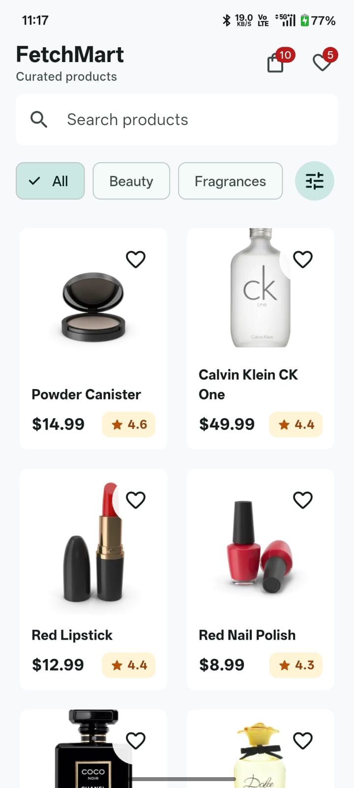
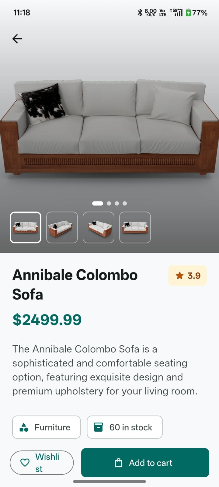
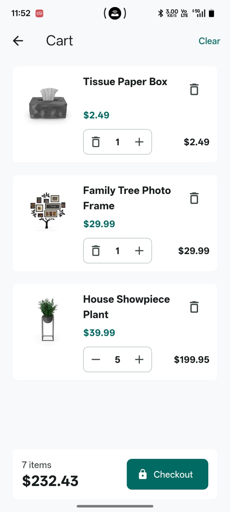
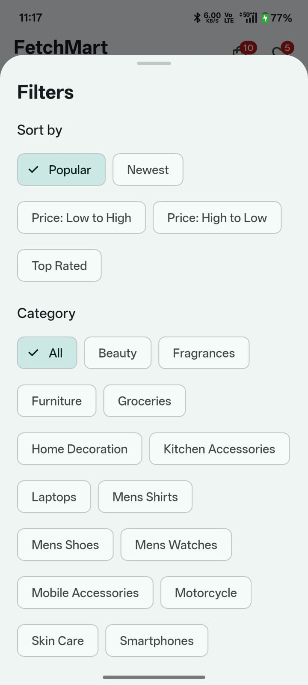
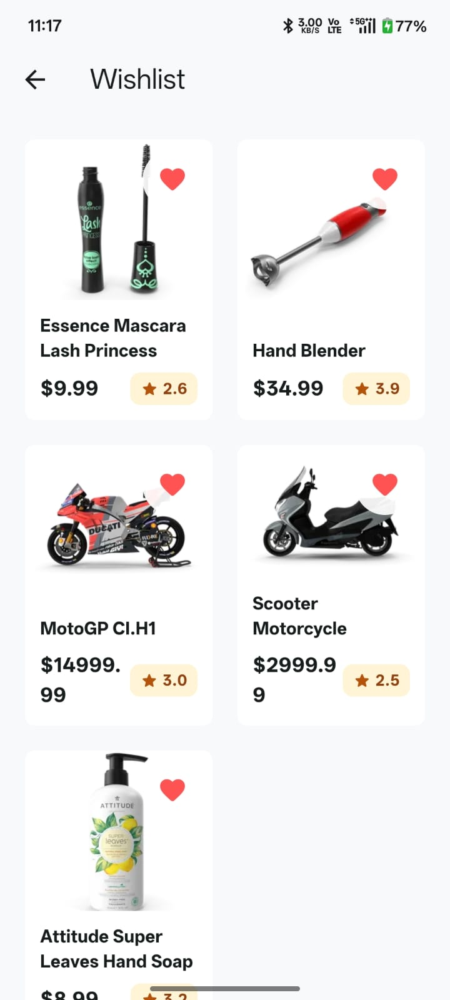

# FetchMart

FetchMart is a modern Flutter product catalog built for the Phase 1 API-based interview assignment. It uses clean architecture, Riverpod, Dio, Hive, shimmer loading states, cached images, local wishlist persistence, offline product cache, search, filters, pagination, and polished Material 3 UI.

## Features

- Product listing from `https://dummyjson.com/products`
- Infinite scrolling with `limit=20` and `skip` pagination
- Product image, title, price, rating badge, and wishlist action
- Product detail screen with hero image transition
- Cart with quantity controls and live total price
- Real-time local title search with 400 ms debounce
- Dynamic category filters from `/products/categories`
- Price range filtering with `RangeSlider`
- Pull-to-refresh and bottom pagination loader
- Skeleton and shimmer loading placeholders
- Friendly empty, offline, timeout, and API failure states
- Local wishlist persisted with Hive
- Offline cache for fetched product responses and categories
- Material 3 light theme with responsive product grids

## Folder Structure

```text
lib/
├── core/
│   ├── constants/
│   ├── network/
│   ├── theme/
│   ├── utils/
│   └── widgets/
├── features/
│   ├── products/
│   │   ├── data/
│   │   ├── domain/
│   │   ├── presentation/
│   │   └── providers/
│   └── wishlist/
│       ├── data/
│       ├── domain/
│       ├── presentation/
│       └── providers/
├── routes/
├── services/
└── main.dart
```

## Architecture

The app follows a feature-first clean architecture layout:

- `domain`: Entities, repository contracts, and use cases.
- `data`: Dio data sources, Hive data sources, model parsing, and repository implementations.
- `presentation`: Screens and reusable UI widgets.
- `providers`: Riverpod controllers and immutable UI state.
- `core`: Shared network, theme, constants, formatters, and common widgets.
- `services`: Dependency injection providers for Dio, Hive boxes, data sources, repositories, and use cases.

The repository pattern keeps API and local persistence details out of the UI. Controllers expose screen-ready state, while widgets remain focused on rendering and user interactions.

## State Management

Riverpod powers dependency injection and UI state.

- `StateNotifierProvider` manages catalog and wishlist state.
- Search updates are debounced before state changes.
- Pagination guards prevent duplicate requests.
- Local filters are derived from already loaded products for fast UI updates.
- Wishlist state keeps both product list and product IDs for quick lookup.

## API Handling

The app uses Dio through a dedicated `ApiClient`.

- Base URL: `https://dummyjson.com`
- Products: `/products?limit=20&skip=0`
- Categories: `/products/categories`
- Category products: `/products/category/{slug}?limit=10&skip=0`

Implemented network concerns:

- Strongly typed model parsing
- Request timeout handling
- Retry mechanism for retryable failures
- Connectivity checks before requests
- Friendly `ApiException` messages
- Hive fallback cache when offline

## Setup

```bash
flutter pub get
flutter run
```

## Assignment Parts

- Part 1 Flutter app: implemented inside `lib/`
- Part 2 DSA answers: available inside `assignment_solutions/part_2_dsa/`
- Part 3 practical answers: available inside `assignment_solutions/part_3_practical/`


## Screenshots

## 📱 App Screenshots

<div align="center">
  <table>
    <tr>
      <td align="center" width="25%">
        <strong>Home Screen</strong><br/>
        
      </td>
      <td align="center" width="25%">
        <strong>Products</strong><br/>
        
      </td>
       <td align="center" width="25%">
        <strong>Cart</strong><br/>
        
      </td>
    </tr>
    <tr>
       </td>
       <td align="center" width="25%">
        <strong>Filters</strong><br/>
        
      </td>
      <td align="center" width="25%">
        <strong>Wishlist</strong><br/>
        
      </td>
    </tr>
  </table>
</div>

---

## 👨‍💻 Developed By

Anuj Rana
Flutter Developer | Full-Stack Developer

Flutter
API
Clean Architecture
Riverpod

Thank you for reviewing this submission.